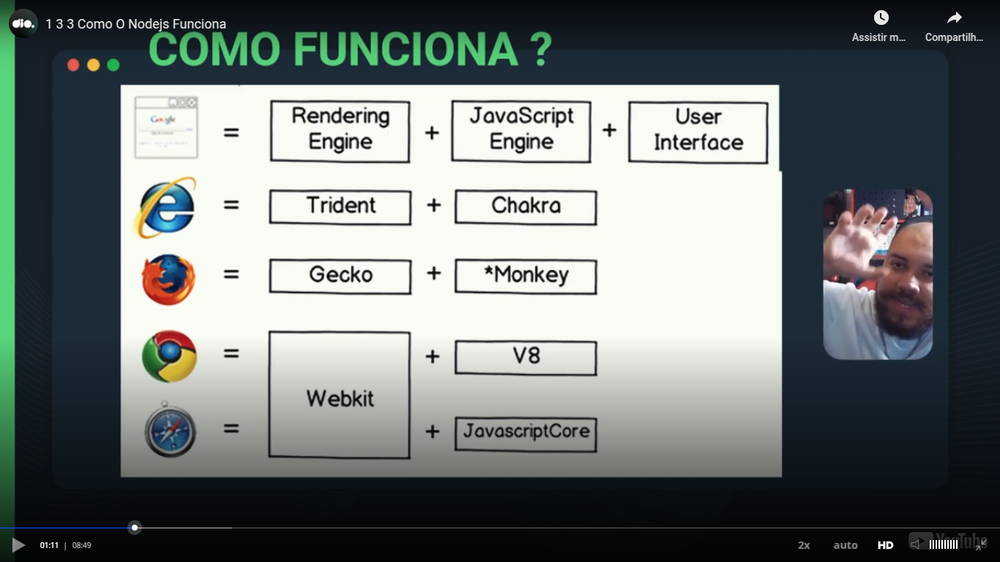

# Introduction

Teacher refered to the "user interface" in the previous image as CSS.

After teacher talked about V8 and Libuv and explained that Ryan Dahl (creator of Node.js and Deno) obtained the V8 engine from Chrome and made the interatction of V8 and a operating system with Libuv.

